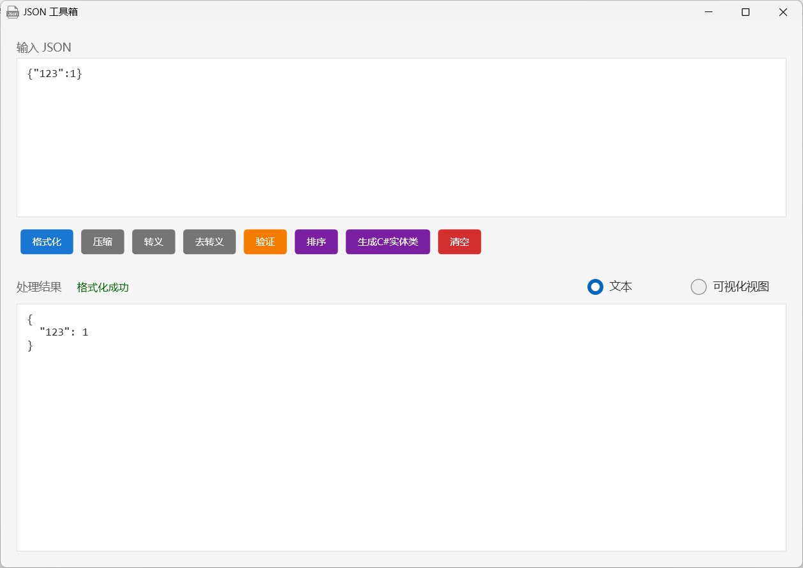
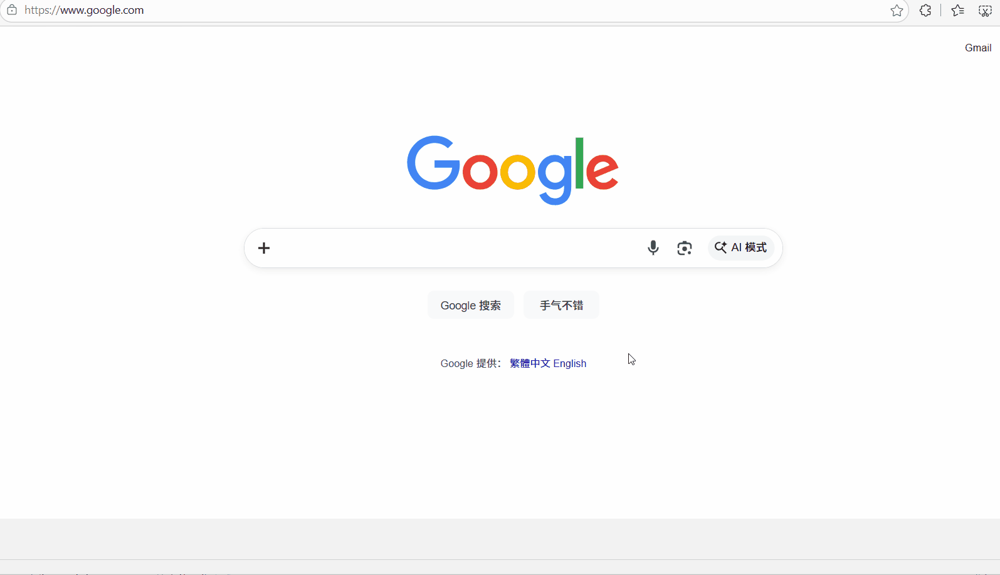

# 这是一个PowerToys.Run的Json工具箱插件

## 如何使用
下载解压后将整个插件目录复制到下面的目录中，然后重启PowerToys
```bash
%LOCALAPPDATA%\Microsoft\PowerToys\PowerToys Run\Plugins
```
如果使用不了可以安装一下.NET8的桌面运行时
[下载地址](https://dotnet.microsoft.com/en-us/download/dotnet/8.0)

## 界面截图


## 演示动画

